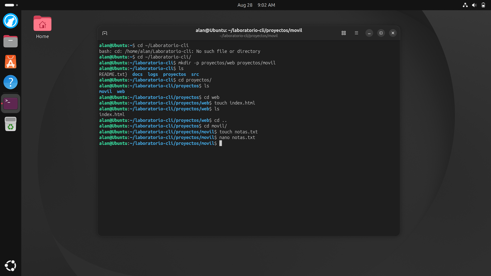
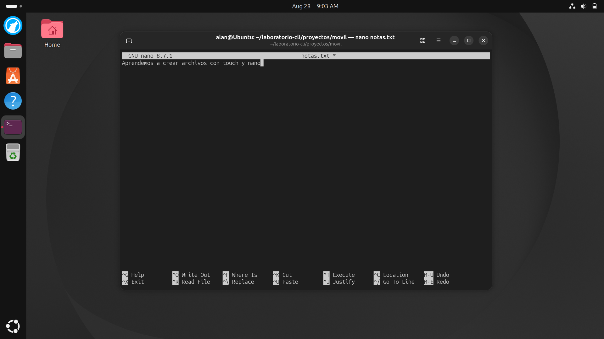
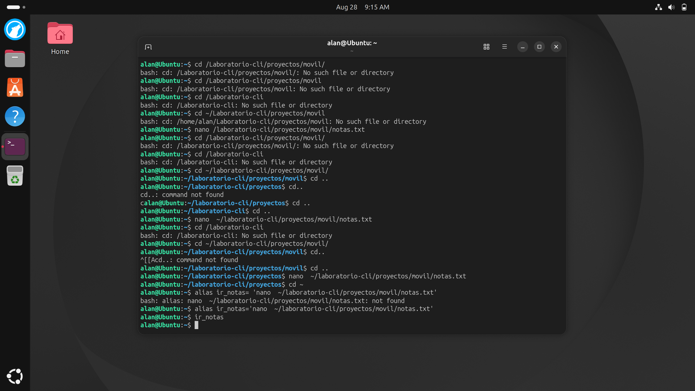
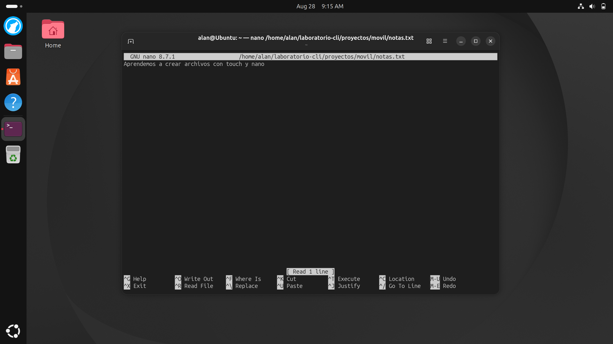
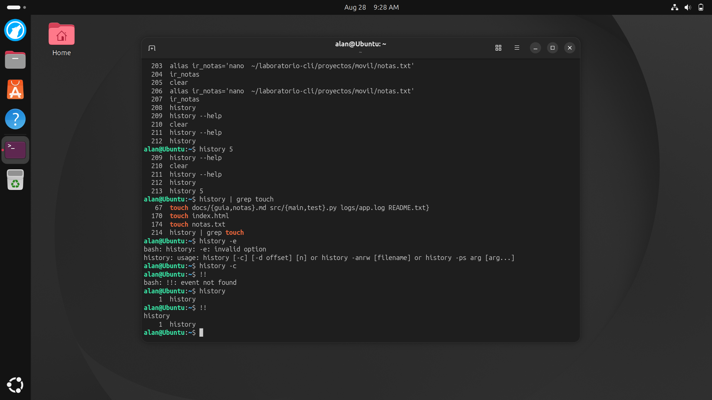
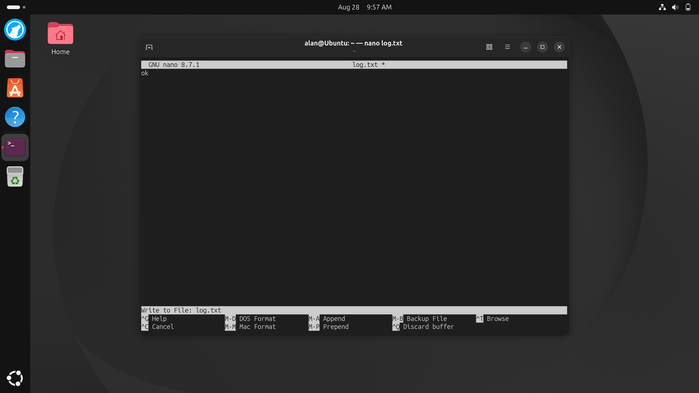
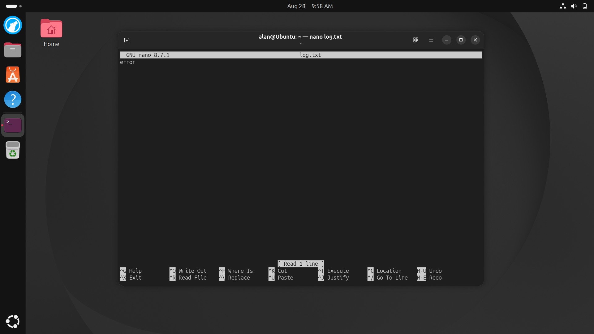
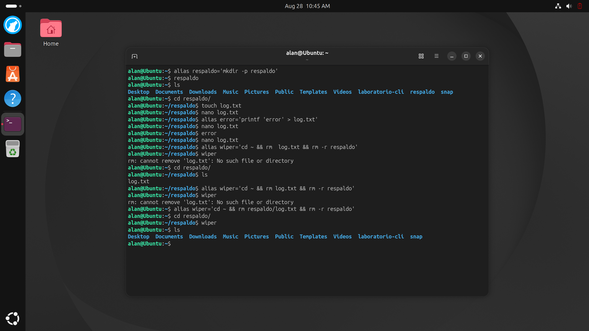

# UNIDAD 1 Practica
---
### (1) Crear dentro de Laboratorio-cli
- 1. Crear carpeta proyectos
  - web, movil
    - index.html

---

### (2) dentro de proyectos/movil crear archivo notas.txt (touch)
- 1. dentro de notas.txt colocar el texto
- 2. "Aprendemos a crear archivos con touch y nano"

---

### (3) Crear un alias llamado ir_notas que abra directamente desde cualquier carpeta el archivo notas.txt

---

### (4)
- 1. Revisar el historial de los ultimos 5 comandos y filtrar su contenido para solo mostrar la ejecucion de touch
- 2. Eliminar el historial de comandos
- 3. Ejecutar !!
- 4. Presentar el historial actual

---

### (5)
- 1. Crear un alias llamado respaldo que genere una carpeta con el mismo nombre
- 2. Ejecutar el alias respaldo
- 3. Entrar a la carpeta respaldo y crear un archivo llamado log.txt
- 4. Dentro de log.txt colocar la palabra "ok"
- 5. Crear un alias que genere una palabra "Error" dentro del archivo log.txt llamado error
- 6. Crear un alias llamado wiper que elimine el archivo log.txt y la carpeta respaldo

